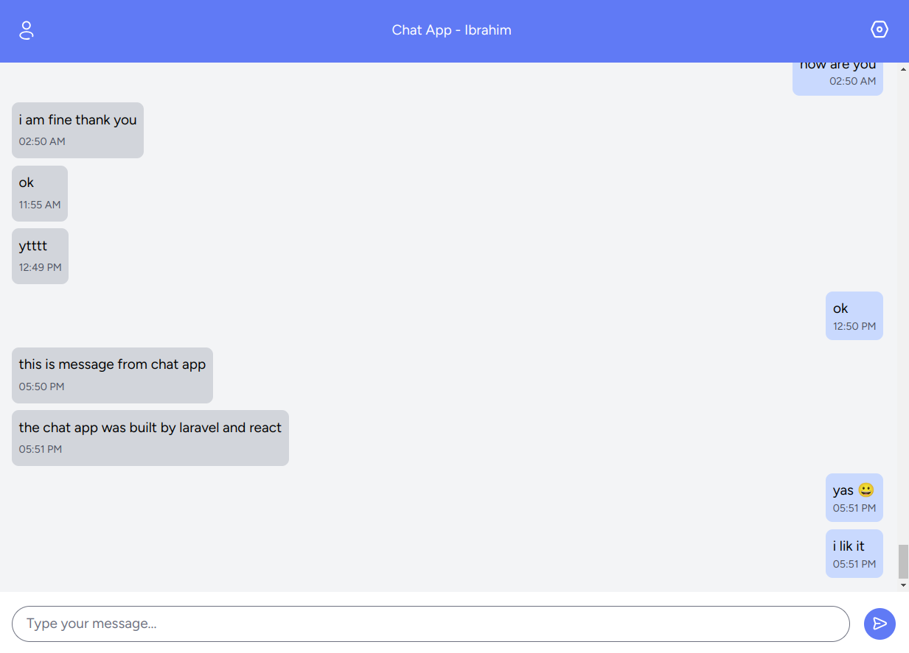

# Real-Time Chat Application



This is a real-time chat application built with Laravel, React, and Pusher. The app allows users to send and receive messages instantly, leveraging Laravel Echo for real-time broadcasting.

## Table of Contents

-   [Features](#features)
-   [Technologies Used](#technologies-used)
-   [Installation](#installation)
-   [Usage](#usage)
    -   [Sending Messages](#sending-messages)
    -   [Receiving Messages](#receiving-messages)
-   [Event Broadcasting Workflow](#event-broadcasting-workflow)
-   [Troubleshooting](#troubleshooting)

## Features

-   Real-time messaging using Laravel Echo and Pusher.
-   Responsive UI built with React and Tailwind CSS.
-   Backend API built with Laravel to handle message storage and retrieval.
-   Authentication using Laravel's built-in features(Breeze starter kit).
-   Easy setup and configuration.

## Technologies Used

-   **Backend:** Laravel, PHP
-   **Frontend:** React, Tailwind CSS
-   **Real-Time Communication:** Pusher, Laravel Echo
-   **Database:** MySQL (or any other supported by Laravel)

## Installation

1. **Clone the repository:**

```bash
    git clone https://github.com/ibrahim11elian/Realtime-Chat-App.git
    cd Realtime-Chat-App
```

2. **Install dependencies:**

```bash
    composer install
    npm install
```

3. **Set up environment variables:**

    Copy the `.env.example` to `.env` and update the necessary configuration, especially for the database and Pusher.

```bash
    cp .env.example .env
    php artisan key:generate
```

4. **Run migrations:**

-   Create database and modify `.env` with your DB name and Pusher credentials.
-   Run the following command to create the database tables:

```bash
    php artisan migrate
```

5. **Set up broadcasting and queue:**

    Start the queue worker:

```bash
    php artisan queue:work
```

6. Compile Assets

Compile the CSS and JavaScript assets:

```bash
npm run dev
```

7. **Start the Laravel server:**

```bash
    php artisan serve
```

The application will be accessible at `http://127.0.0.1:8000`.

## Usage

**Login and Registration:**

-   Create an account an navigate to the chat page

### Sending Messages

To send a message:

-   Type your message in the input field and click the "Send" button.
-   The message will be sent to the backend, stored in the database, and broadcast to all connected clients.

### Receiving Messages

-   Messages will appear in the chat window in real-time as they are broadcasted to the `chat` channel.

## Event Broadcasting Workflow

1. **User sends a message:**

    - The message is sent to the backend via an API request.
    - The message is stored in the database.

2. **MessageSent Event:**

    - After storing the message, a `MessageSent` event is dispatched.
    - This event is broadcasted to the `chat` channel using Laravel Echo.

3. **Frontend Receives the Event:**
    - The frontend listens to the `chat` channel for `MessageSent` events.
    - When an event is received, the message is appended to the chat window.

## Troubleshooting

-   **No messages appear:**

    -   Ensure the backend server is running and broadcasting events.
    -   Check the Pusher console for any errors or missing events.
    -   Verify that your environment variables are correctly set.

-   **Pusher not connecting:**

    -   Check your Pusher credentials in the `.env` files.
    -   Ensure your network allows WebSocket connections.

-   **Messages not broadcasting:**
    -   Make sure the queue worker is running.
    -   Check Laravel logs for any errors related to broadcasting.

_Not: This is a one channel chat app all users can send messages to every one through this channel_

## Author

<p align="left">

<a href="https://www.linkedin.com/in/ibrahim-ahmed-a8bba9196" target="_blank">
</a>
<a href="https://www.facebook.com/ibrahim11ahmed" target="_blank">
</a>
<a href="mailto:ibrahim11elian@gmail.com" target="_blank">
</a>
<a href="tel:+201157676284" target="_blank">
</a>
<a href="https://www.instagram.com/ibrahim11ahmed/" target="_blank">
</a>
<a href="https://twitter.com/ibrahim11elian" target="_blank">
<a href="https://leetcode.com/ibrahim11elian" target="_blank">

</p>
